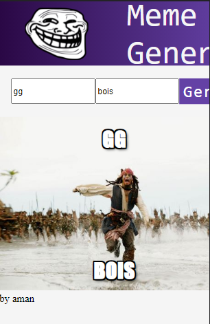

# Meme generator app

 If you want to run this project at your local system, then you must have node installed in your pc 

 

 Command to run this project

`node start`
 

 You can also see this app online with just a single click 

 
`<a href="https://meme-generator-by-aman.netlify.app/">Click here</a>`
 
